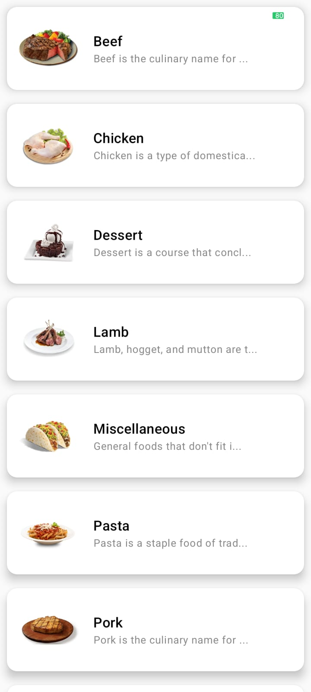

# Recipe-App 🍲
Modern Android app built with Jetpack Compose, featuring clean MVVM architecture, centralized navigation, and minimal Gradle dependencies. Implements repository pattern aligned with real API responses, Coil for image loading, and polished WhatsApp‑style UI. Designed for scalability, performance, and a smooth user experience.

---

## ✨ Features
- Browse recipes with a clean Compose UI
- Centralized navigation with `NavGraph`
- MVVM + Repository pattern for scalability
- API integration with Retrofit
- Coil for image loading
- Minimal Gradle setup for maintainability

---

## 🛠 Tech Stack
- Kotlin
- Jetpack Compose
- MVVM Architecture
- Retrofit / OkHttp
- Coil
- Gradle (KTS)

---

## 🏗 Architecture Overview
The app follows **MVVM + Repository pattern**:

- **UI Layer (Compose Screens)**: `RecipeScreen`, `RecipeDetailScreen`, `MealsScreen`
- **Navigation**: `NavGraph.kt`
- **ViewModels**: `MainViewModel`, `MealViewModel`, `DetailViewModel`
- **Repository**: `RecipeRepository.kt`
- **Data Layer**: `ApiService.kt` + Models (`MealModel`, `DetailModel`)

---

## 📸 Screenshots
### Home Screen


### Recipe Detail


---

## 🚀 Getting Started
1. Clone the repo:
   ```bash
   git clone https://github.com/abhitiwari00108/Recipe-App.git
